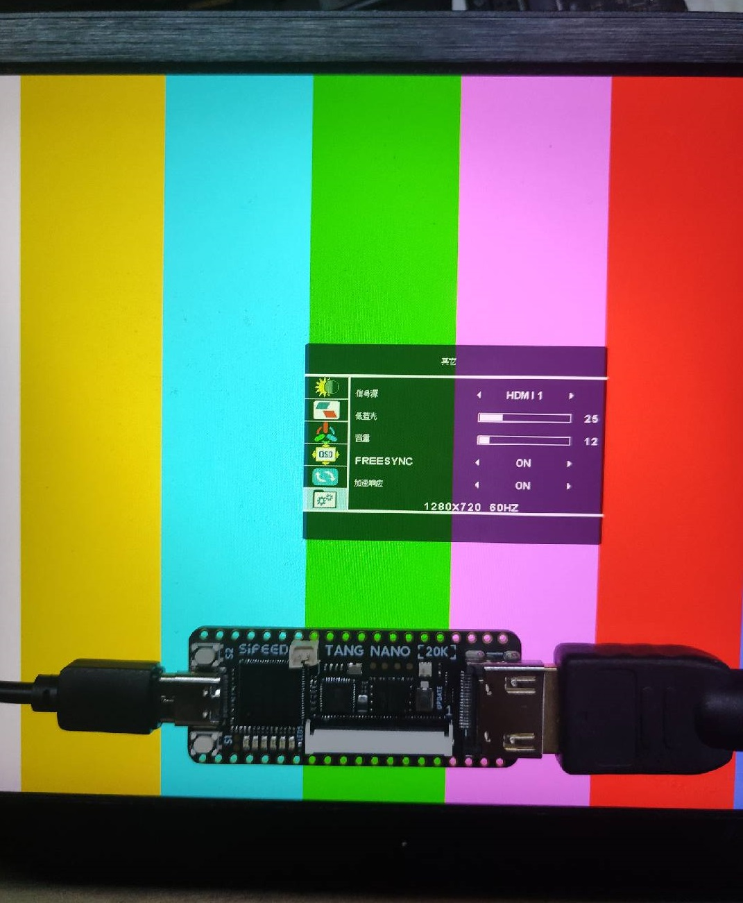
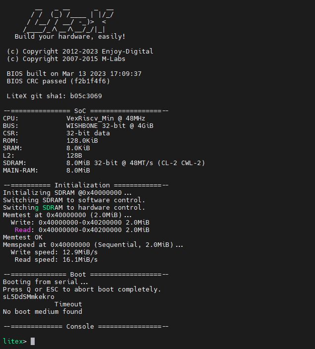

# TangNano-20K-example

---
- IDE 基础使用步骤:[点我](https://wiki.sipeed.com/hardware/zh/tang/tang-nano-20k/example/led.html)
- IDE Instructions:[Click me](https://wiki.sipeed.com/hardware/en/tang/tang-nano-20k/example/led.html)
---
- 配置 MS5351:[点我](https://wiki.sipeed.com/hardware/zh/tang/tang-nano-20k/example/unbox.html)
- Config MS5351:[Click me](https://wiki.sipeed.com/hardware/en/tang/tang-nano-20k/example/unbox.html)
---

- [TangNano-20K-example](#tangnano-20k-example)
  - [audio](#audio)
  - [hdmi](#hdmi)
  - [litex](#litex)
  - [rgb\_lcd](#rgb_lcd)
  - [uart](#uart)
  - [ws2812](#ws2812)
  - [nestang](#nestang)
  - [linux](#linux)
  - [riscv\_core](#riscv_core)
    - [SparrowRV](#sparrowrv)

## audio

Demo to drive the onboard DAC. A bit loud.

## hdmi

A demo to drive a hdmi screen with resolution 1280\*720

## litex

A [litex](https://github.com/litex-hub) firmware for Tang Nano 20K, thanks [Icenowy](https://github.com/Icenowy) shared this firmware.

## rgb_lcd

Demos to drive the rgb_lcd screen, 800_480 is for screen with 800\*480 resolution, and 480_272 is for screen with 480\*272 resolution.

## uart

FPGA uart example, containing 2 uart example messages. Burn into FPGA and open onboard serial port to check the message with 115200 baudrate.

FPGA can not be burned when the serial port is opened.

## ws2812

A demo to drive onboard ws2812 rgb led.

## nestang

Thanks to [nand2mario](https://github.com/nand2mario) for providing this project, and read [guide](./nestang/README.md) to see how to build this project.

## linux

A linux demo based on [Linux-on-LiteX-VexRiscv](https://github.com/litex-hub/linux-on-litex-vexriscv).

## riscv_core

### SparrowRV

A Risc-V architecture open source core. Run command `git submodule update --init --recursive` in `TangNano-20K-example` folder to get the code.
